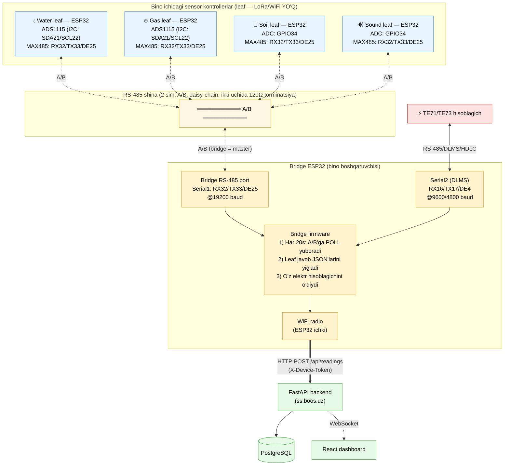
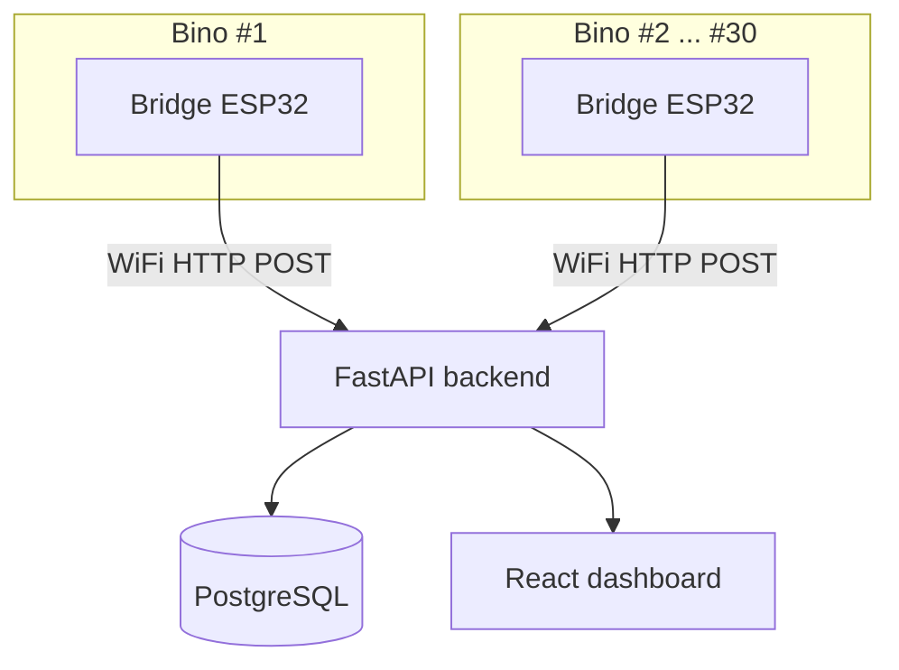

# iot_v2 — Bino ichi RS-485 shinasi arxitekturasi

`iot_v2` — `iot/`ning LoRa'siz versiyasi. Har bir bino WiFi/internetga ega
bo'lgani uchun LoRa radio, mesh protokol va alohida gateway qurilmalari
kerak emas — bino ichidagi sensorlar RS-485 orqali bitta "bridge" ESP32'ga
yig'iladi, bridge esa to'g'ridan-to'g'ri WiFi orqali backend'ga yuboradi.

## To'liq ulanish diagrammasi (bitta bino)

## Shahar miqyosida (ko'p bino)

Har bino — mustaqil: o'z WiFi/internetiga, o'z bridge'iga ega. Bridge'lar
bir-biri bilan gaplashmaydi, hech qanday mesh/relay yo'q — bu LoRa
arxitekturasidan asosiy farq.

## Texnik tayanch nuqtalar

- **Leaf'lar generik/"ahmoq"** — qaysi binoda ekanini bilmaydi, faqat
  sensordan o'qib RS-485'ga JSON chiqaradi. Barcha leaf bir xil pinlarda
  ishlaydi (RX32/TX33/DE25, 19200 baud) — bitta vaqtda faqat bittasi
  gapiradi (bridge navbat bilan so'raydi, `RS485_POLL_BYTE` broadcast).
- **Bridge — ikkita mustaqil UART**:
  - `Serial1` — yangi RS-485 leaf shinasi (`rs485_bus.h`)
  - `Serial2` — eski, ishlab turgan DLMS elektr hisoblagich liniyasi
    (`sensors/dlms.h`, RX16/TX17/DE4) — bunga tegilmagan
- **LoRa yo'q** — bridge to'g'ridan-to'g'ri WiFi orqali `/api/readings`ga
  POST qiladi (mavjud offline-bufer/retry mexanizmi bilan, xuddi oddiy
  WiFi sensorlardagi kabi).
- **JSON format** — leaf `sensor_build_json()` (mavjud, `sensors/*.h`) bilan
  bir xil JSON'ni quradi; bridge faqat NTP timestamp qo'shib, o'zgarishsiz
  forward qiladi. Backend/gateway kod darajasida hech narsa o'zgarmagan.

## Fayllar

| Fayl | Vazifa |
|---|---|
| `include/rs485_bus.h` | Past darajali RS-485 freym yuborish/qabul qilish |
| `include/rs485_leaf.h` | Leaf firmware (`-DRS485_LEAF`) |
| `include/rs485_bridge.h` | Bridge qo'shimchasi (`-DRS485_BRIDGE`) |
| `platformio.ini` | `water_rs485_leaf`, `gas_rs485_leaf`, `soil_rs485_leaf`, `sound_rs485_leaf`, `building_bridge` environmentlari |
